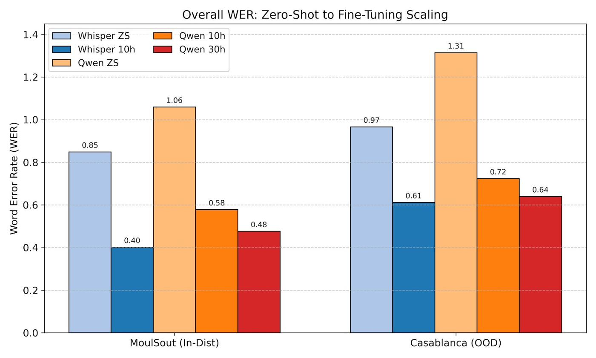
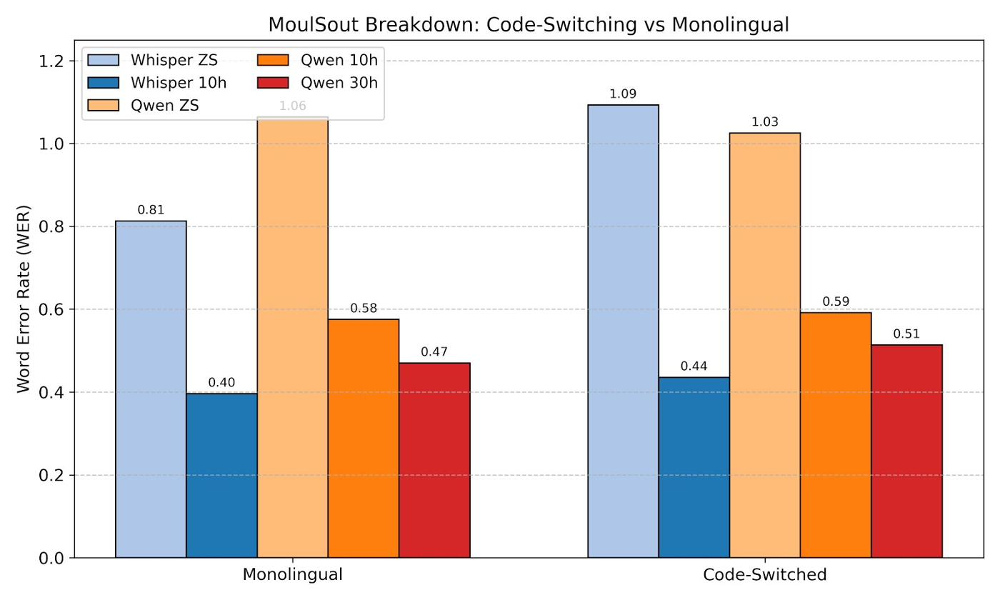

# Darija-ASR · End-to-End vs Cascaded Architectures for Moroccan Darija Speech Recognition

> A controlled comparison of **Qwen2-Audio-7B** (end-to-end audio-LLM) and **Whisper-Large-v3** (cascaded ASR) for Moroccan Darija (الدارجة المغربية), fine-tuned with LoRA under the **Marco-ASR** adaptive learning-rate framework. Same data, same splits, same seeds, same evaluation protocol — only the architecture changes.

[](https://opensource.org/licenses/MIT)
[](https://www.python.org/)
[](https://huggingface.co/Tilas)

---

## 🎯 Headline Result

On **MoulSot** (in-distribution Darija ASR), **Whisper-Large-v3** beats **Qwen2-Audio-7B** at every training scale, by a margin that holds in both the code-switched and monolingual partitions, and on out-of-distribution audio (Casablanca-Morocco). The gap closes with more data but does not vanish.



| Model                      | Params  | 10h WER          | 30h WER          | 30h OOD WER       | 30h GPU-hr |
|----------------------------|---------|------------------|------------------|-------------------|------------|
| Qwen2-Audio-7B (zero-shot) | 8.4B    | 105.90%          | —                | 131.40%           | —          |
| Whisper-LV3 (zero-shot)    | 1.5B    | 84.85%           | —                | 96.62%            | —          |
| Qwen2-Audio-7B + LoRA      | +9.4M   | 57.76%           | 47.58%           | 63.98%            | 8.89       |
| **Whisper-LV3 + LoRA**     | **+15M**| **40.14%** ⭐     | **39.23%** ⭐     | **58.92%** ⭐     | **3.41**   |

(95% bootstrap CIs in [§ Detailed results](#-detailed-results). Lower is better.)

**Takeaways:**
1. Whisper-LV3 wins on every partition at every scale, with **~8 percentage points** absolute WER gap at 30h.
2. Whisper trains **~2.6× faster** at 30h despite identical effective batch and LoRA rank — direct consequence of being **5.6× smaller**.
3. The architectural mismatch is real: the LLM-based Qwen2-Audio starts much further from Darija (>100% WER zero-shot, MSA fallback + hallucinations) and never catches up within 30 hours of data.
4. Code-switching costs Whisper more than monolingual at every scale (3-4pp), but both models remain robust under partitioning.

---

## 📦 What's in this repo

```
darija-asr-comparison/
├── README.md                                  ← you are here
├── docs/
│   ├── METHODOLOGY.md                         ← full Phase 1 methodology (~6,000 words)
│   ├── REPRODUCING.md                         ← step-by-step replication on RunPod / any GPU pod
│   └── RESULTS.md                             ← extended results (per-partition, learning curves, gaps)
├── notebooks/
│   ├── qwen2audio_darija_finetune.ipynb       ← Marco-ASR Algorithm 1 (single adaptive LR)
│   └── whisper_v3_darija_finetune.ipynb       ← Marco-ASR Algorithm 2 (encoder + decoder LRs)
├── results/
│   ├── aggregate_metrics.csv                  ← all WER/CER/CIs across (model × scale × dataset × partition)
│   ├── training_costs.csv                     ← wall-clock, best-step, convergence info
│   ├── learning_curve_points.csv              ← WER vs hours-of-data for both models
│   ├── learning_efficiency.csv                ← WER-points-reduced-per-train-hour
│   ├── generalization_and_codeswitch_gaps.csv ← OOD gap + CS-vs-mono partitioned WERs
│   ├── lora_footprint.csv                     ← LoRA module audit (encoder/decoder split)
│   └── plots/                                 ← four diagnostic figures (PNG)
├── requirements.txt                           ← pinned environment
├── CITATION.cff                               ← GitHub auto-renders "Cite this repository"
├── LICENSE                                    ← MIT
└── .gitignore
```

---

## 🤗 Fine-tuned models on Hugging Face

All four adapters + model cards + research artifacts are public:

| Model | HF Hub URL |
|---|---|
| Qwen2-Audio-7B + LoRA, 10h | [`Tilas/qwen2-audio-darija-marco-10h`](https://huggingface.co/Tilas/qwen2-audio-darija-marco-10h) |
| Qwen2-Audio-7B + LoRA, 30h | [`Tilas/qwen2-audio-darija-marco-30h`](https://huggingface.co/Tilas/qwen2-audio-darija-marco-30h) |
| Whisper-LV3 + LoRA, 10h    | [`Tilas/whisper-lv3-darija-marco-10h`](https://huggingface.co/Tilas/whisper-lv3-darija-marco-10h)  |
| Whisper-LV3 + LoRA, 30h    | [`Tilas/whisper-lv3-darija-marco-30h`](https://huggingface.co/Tilas/whisper-lv3-darija-marco-30h)  |

Each repo carries the LoRA adapter + tokenizer/processor + a `research_artifacts/` directory with the full per-utterance details JSON, Marco-ASR training history, training-cost log, and LoRA target audit.

---

## ⚡ Quick start — use a model

```python
# pip install transformers peft accelerate librosa torch
from transformers import WhisperForConditionalGeneration, WhisperProcessor
from peft import PeftModel
import torch, librosa

REPO = "Tilas/whisper-lv3-darija-marco-30h"   # best of the four

base = WhisperForConditionalGeneration.from_pretrained(
    "openai/whisper-large-v3", torch_dtype=torch.bfloat16, attn_implementation="sdpa").to("cuda")
base.config.forced_decoder_ids = None
base.config.suppress_tokens = []
model = PeftModel.from_pretrained(base, REPO).to("cuda").eval()
processor = WhisperProcessor.from_pretrained(REPO)

audio, _ = librosa.load("darija_sample.wav", sr=16000)
feats = processor.feature_extractor(audio, sampling_rate=16000, return_tensors="pt").input_features
feats = feats.to("cuda", dtype=torch.bfloat16)
fdi = processor.get_decoder_prompt_ids(language="arabic", task="transcribe")

with torch.no_grad():
    pred = model.generate(input_features=feats, forced_decoder_ids=fdi, max_new_tokens=225, num_beams=1)

print(processor.tokenizer.batch_decode(pred, skip_special_tokens=True)[0])
```

For Qwen2-Audio usage, see the model card on the [Hub](https://huggingface.co/Tilas/qwen2-audio-darija-marco-30h).

---

## 🔬 Methodology in one paragraph

We fine-tune both base models with **LoRA** (`r=32`, `α=32`, `dropout=0.1`, rsLoRA, `target_modules="all-linear"`) on **MoulSot-Full** (`atlasia/MoulSot-Full`, config `100-gt-2.5`), sampled at 10h and 30h with `seed=42` from a deterministic shuffle so larger scales are supersets of smaller ones. We use the **Marco-ASR** adaptive-LR framework (Ni et al. 2025): Algorithm 1 (single adaptive LR) for the LLM-based Qwen2-Audio, Algorithm 2 (separate encoder + decoder LRs) for the encoder-decoder Whisper — using Algorithm 1 on Whisper would yoke two components with very different optimization needs, biasing the comparison. The LR is recomputed every N steps based on current WER on a held-out 200-1000 utterance subset of the val set; early stopping triggers after 3 consecutive evals without ≥0.5pp improvement. Effective batch size is 16 (per-device 4 × grad-accum 4) for both models. We evaluate with corpus-level micro-average WER/CER using **Casablanca normalization** (Talafha et al. 2024), partition predictions into code-switched (reference contains both Arabic and Latin characters) and monolingual, and report **95% paired-bootstrap confidence intervals** from 1000 resamples. The MoulSot test split (1962 utterances after filtering) is the in-distribution headline; we additionally evaluate on 500 OOD samples from `UBC-NLP/Casablanca` (Morocco subset).

Full methodological detail (research questions, hypotheses, threats to validity, design rationale) is in [`docs/METHODOLOGY.md`](docs/METHODOLOGY.md).

---

## 🔁 Reproducing the experiments

See [`docs/REPRODUCING.md`](docs/REPRODUCING.md) for the full guide. TL;DR:

**Hardware**: A single NVIDIA A40 (48 GB VRAM) is sufficient. We used **RunPod** with the official `runpod/pytorch:2.4.0-py3.11-cuda12.4.1-devel-ubuntu22.04` template + a 100 GB network volume mounted at `/workspace`.

**Compute budget** (real wall-clock):

| Run            | GPU-hours |
|----------------|-----------|
| Qwen2-Audio 10h | 2.09     |
| Qwen2-Audio 30h | 8.89     |
| Whisper-LV3 10h | 2.22     |
| Whisper-LV3 30h | 3.41     |
| Zero-shot evals (both models, both eval sets) | ~1.5 |
| **Total**       | **~18**  |

At A40 spot rates (~$0.35-$0.50/hr on RunPod community cloud), the full Phase 1 replication is roughly **$6-$9 of GPU time**.

**Quick path:**
```bash
git clone https://github.com/Tilas/darija-asr-comparison.git
cd darija-asr-comparison
pip install -r requirements.txt
# Launch RunPod pod, mount network volume, then in Jupyter:
#   1. Open notebooks/whisper_v3_darija_finetune.ipynb
#   2. Set DATA_SCALE_HOURS = 10 in Cell 1
#   3. Run all cells (top to bottom)
#   4. Repeat for DATA_SCALE_HOURS = 30 and for the Qwen2-Audio notebook
```

Outputs land in `/workspace/outputs/{results,logs}/`. The Casablanca-normalization rules, code-switching detection, bootstrap CI, and partitioning logic are byte-identical between the two notebooks for fair comparison.

---

## 📊 Detailed results

### MoulSot test set (in-distribution, 1962 utterances after filtering)

| Model                 | Scale | Partition        | n    | WER % [95% CI]              | CER % [95% CI]             |
|-----------------------|-------|------------------|------|-----------------------------|----------------------------|
| Qwen2-Audio (ZS-strict) | —   | full             | 1962 | 118.15 [115.92, 120.67]    | 96.08 [93.95, 98.40]      |
| Qwen2-Audio (ZS-Darija) | —   | full             | 1962 | 105.90 [103.87, 108.21]    | 88.39 [86.56, 90.40]      |
| Whisper-LV3 (ZS)       | —    | full             | 1962 | 84.85 [81.20, 88.97]       | 48.05 [45.42, 51.06]      |
| Qwen2-Audio + LoRA     | 10h  | full             | 1962 | 57.76 [56.92, 58.60]       | 23.45 [22.85, 24.08]      |
| Qwen2-Audio + LoRA     | 30h  | full             | 1962 | 47.58 [46.61, 48.61]       | 18.23 [17.61, 18.96]      |
| **Whisper-LV3 + LoRA** | **10h**  | **full**      | 1962 | **40.14 [39.29, 41.03]**   | **14.13 [13.62, 14.68]**  |
| **Whisper-LV3 + LoRA** | **30h**  | **full**      | 1962 | **39.23 [38.23, 40.33]**   | **14.23 [13.55, 15.03]**  |

### Casablanca Morocco (OOD, 500 utterances)

| Model                  | Scale | Partition | n   | WER % [95% CI]              |
|------------------------|-------|-----------|-----|-----------------------------|
| Qwen2-Audio (ZS-strict)| —     | full      | 500 | 131.40 [120.99, 145.86]    |
| Whisper-LV3 (ZS)       | —     | full      | 500 | 96.62 [87.36, 108.44]      |
| Qwen2-Audio + LoRA     | 10h   | full      | 500 | 72.34 [70.21, 74.65]       |
| Qwen2-Audio + LoRA     | 30h   | full      | 500 | 63.98 [62.17, 65.77]       |
| **Whisper-LV3 + LoRA** | **10h**  | **full** | 500 | **61.12 [59.24, 62.86]**   |
| **Whisper-LV3 + LoRA** | **30h**  | **full** | 500 | **58.92 [57.00, 60.69]**   |

### Code-switched partition (MoulSot test, n=194)



| Model                  | Scale | CS WER % | Mono WER % | CS − Mono (pp) |
|------------------------|-------|----------|------------|----------------|
| Qwen2-Audio + LoRA     | 10h   | 59.15    | 57.56      | +1.6           |
| Qwen2-Audio + LoRA     | 30h   | 51.36    | 47.03      | +4.3           |
| Whisper-LV3 + LoRA     | 10h   | 43.57    | 39.64      | +3.9           |
| Whisper-LV3 + LoRA     | 30h   | 41.28    | 38.93      | +2.4           |

Code-switched audio is harder for both models, but the gap is small relative to the cross-architecture gap.

### Data efficiency (WER reduction per training hour)

| Model            | 10h → 30h Δ WER (pp) | Cost (extra GPU-hr) | pp per GPU-hr |
|------------------|----------------------|----------------------|---------------|
| Qwen2-Audio      | -10.2 pp             | +6.8                 | -1.50         |
| Whisper-LV3      | -0.9 pp              | +1.2                 | -0.74         |

Whisper saturates faster (10h is already close to its 30h ceiling); Qwen2-Audio is still climbing. This suggests 80h might still help Qwen2-Audio more than Whisper, but neither is likely to overtake Whisper-LV3's 10h result at any plausible Qwen2-Audio scale.

Extended tables (CER, RTF, per-step convergence, OOD CIs) in [`docs/RESULTS.md`](docs/RESULTS.md).

---

## 🛠 Engineering features (Phase 1 hardening)

Both notebooks include production-grade robustness:

- **Auto-resume from latest checkpoint** with strict regex (`^checkpoint-(\d+)$`) so renamed `.corrupted_*` dirs aren't matched.
- **Auto-fallback wrapper**: on resume failure, renames the broken checkpoint aside and retries up to 3 times with progressively older ones.
- **DiskSpaceGuardCallback**: aborts training cleanly via `control.should_training_stop=True` before a save would fail due to disk fill (≥8 GB threshold).
- **PyTorch 2.6 compat patch**: `torch.load` is monkey-patched to default `weights_only=False` for HF Trainer's `rng_state.pth` (which contains numpy state objects that fail the new strict default).
- **Stale-state safety**: `MarcoASRCallback` reconstructs `best_wer` and `no_improve_count` from the history JSON on resume, so an interrupted run picks up its early-stopping state exactly where it left off.
- **`.ipynb_checkpoints` guard** in all file-copy operations.
- **Forward-pass smoke test** in the LoRA cell so signature mismatches surface before the training loop, not at step 1.

---

## 🧠 Lessons learned (gotchas worth documenting)

These cost hours to discover. They're documented here so others don't repeat them:

1. **PEFT `task_type=SEQ_2_SEQ_LM` is wrong for Whisper.** Whisper takes `input_features`, not `input_ids`. Using `PeftModelForSeq2SeqLM` causes `TypeError: WhisperForConditionalGeneration.forward() got an unexpected keyword argument 'input_ids'` at step 1. Fix: omit `task_type` so PEFT uses the base `PeftModel` class whose forward forwards kwargs as-is. The official Sanchit Gandhi Whisper-LoRA recipe omits task_type for exactly this reason.

2. **Algorithm 1 vs Algorithm 2 matters.** Using a single LR (Algorithm 1) on Whisper's encoder + decoder underperforms because the encoder is already a strong audio representation extractor (small LR suffices) while the decoder needs a larger LR to learn the new output distribution. We explicitly separate them via named param groups (`name="encoder"` / `name="decoder"`) so the LR adjustments survive optimizer save/resume.

3. **`torchcodec` is required by recent `datasets` versions.** If `datasets>=3.0`, audio decoding fails without `torchcodec` installed. Solution: pin it in `requirements.txt` and import-check in the install cell.

4. **Reduce `save_steps` early.** With Qwen2-Audio's ~2.5 GB per checkpoint, the default save cadence + `save_total_limit=3` is fine, but if a run gets killed at step 499 you lose ~500 steps. We use `save_steps=200` for finer fallback granularity.

5. **Clean resume requires deleting all three artifacts together.** Trainer dir, best-marco-asr dir, AND the history JSON — otherwise the callback resumes with stale `best_wer`/`no_improve_count` from the history and may prematurely early-stop a fresh run.

---

## 🔮 Phase 2 (not in this artifact)

This repo covers **Phase 1**: the ASR-only comparison. **Phase 2** (deferred) is the downstream chatbot-conversation evaluation with human raters, including LLM response quality on top of ASR transcripts. Phase 1 establishes the ASR component choice; Phase 2 will integrate it into the voice assistant pipeline.

---

## 📚 Citation

If you use this work, please cite the repository and the underlying frameworks:

```bibtex
@misc{darija-asr-comparison-2026,
  title        = {{Darija-ASR: A Controlled Comparison of End-to-End and Cascaded
                   Architectures for Moroccan Darija Speech Recognition}},
  author       = {Echchalim, Aymen},
  year         = {2026},
  howpublished = {\url{https://github.com/Tilas/darija-asr-comparison}},
  note         = {PFE Phase 1 — end-to-end Qwen2-Audio vs cascaded Whisper-LV3 under Marco-ASR LoRA fine-tuning}
}

@misc{ni2025marcoasr,
  title  = {{Marco-ASR: A Principled and Metric-Driven Framework for Fine-Tuning
            Large-Scale ASR Models for Domain Adaptation}},
  author = {Ni et al.},
  year   = {2025},
  eprint = {2512.22165},
}

@inproceedings{talafha2024casablanca,
  title     = {{Casablanca: Data and Models for Multidialectal Arabic Speech Recognition}},
  author    = {Talafha, Bashar et al.},
  booktitle = {EMNLP},
  year      = {2024},
}
```

A `CITATION.cff` is included so GitHub auto-renders a "Cite this repository" button.

---

## 🙏 Acknowledgments

- **AtlasIA** for the `MoulSot-Full` Darija speech corpus.
- **UBC-NLP** for the `Casablanca` multidialectal Arabic ASR benchmark.
- **OpenAI** for `whisper-large-v3` and **Alibaba/Qwen team** for `Qwen2-Audio-7B-Instruct`.
- **HuggingFace** for the `transformers`, `peft`, `datasets`, and `accelerate` stacks.
- **Ni et al.** for the Marco-ASR framework.
- **Talafha et al.** for the Casablanca normalization protocol.
- **RunPod** for affordable GPU compute.

This work is the Phase 1 deliverable of a PFE (Projet de Fin d'Études) supervised by Professor Hafidi Imad at the National School of Applied Sciences Khouribga.

---

## 📄 License

MIT. The LoRA adapters on Hugging Face inherit licensing from their base models (Apache 2.0 for both Whisper-LV3 and Qwen2-Audio-7B-Instruct).

---

## 📬 Contact

- Hugging Face: [@Tilas](https://huggingface.co/Tilas)
- GitHub Issues for bugs / questions / reproduction failures
- 
